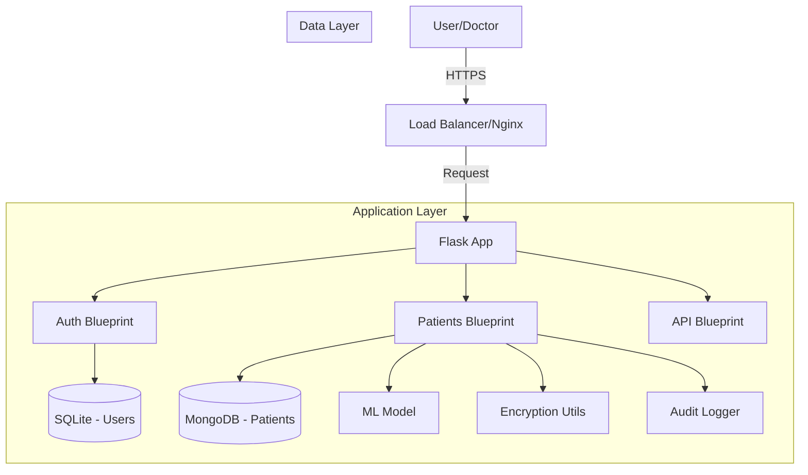

# Stroke Risk Prediction & Patient Management App

A secure, modular Flask application designed for managing patient records and predicting stroke risk. Built with a dual-database architecture (SQLite + MongoDB) and high-level security features.

## Features

*   **Dual Database Architecture**: SQLite for relational user data, MongoDB for flexible patient records.
*   **Secure Authentication**: Argon2 hashing, Flask-Login, and 2FA (TOTP).
*   **Patient Management**: Full CRUD operations with search and pagination.
*   **Data Security**: Sensitive patient data (Glucose, BMI) encrypted at rest using Fernet.
*   **Audit Logging**: Comprehensive logging of all user actions.
*   **Stroke Prediction**: Integrated Machine Learning model (RandomForest) to predict stroke risk.
*   **Export**: Generate encrypted PDF reports for patients.
*   **API**: RESTful API with Swagger documentation.
*   **Dockerized**: Easy deployment with Docker Compose.

## Architecture



## Setup & Installation

### Prerequisites
- Python 3.9+
- MongoDB
- Docker (optional)

### Local Development
1.  Clone the repository:
    ```bash
    git clone https://github.com/yourusername/stroke-app.git
    cd stroke-app
    ```
2.  Create a virtual environment:
    ```bash
    python -m venv venv
    source venv/bin/activate  # On Windows: venv\Scripts\activate
    ```
3.  Install dependencies:
    ```bash
    pip install -r requirements.txt
    ```
4.  Set environment variables (create `.env`):
    ```
    SECRET_KEY=your-secret-key
    MONGO_URI=mongodb://localhost:27017/stroke_app
    ENCRYPTION_KEY=8co-7-z1x4-7-z1x4-7-z1x4-7-z1x4-7-z1x4-7-z1x4=
    ```
5.  Run the application:
    ```bash
    python run.py
    ```

### Docker Deployment
1.  Build and run with Compose:
    ```bash
    docker-compose up --build
    ```
2.  Access the app at `http://localhost:5000`.

## API Documentation
The API documentation is available at `/api/docs` when the application is running.

## Testing
Run the test suite with coverage:
```bash
pytest --cov=app tests/
```

## Security Decisions
-   **Argon2**: Chosen for its resistance to GPU-based cracking attacks.
-   **Fernet (Symmetric Encryption)**: Used for encrypting sensitive medical data (BMI, Glucose) to ensure confidentiality at rest.
-   **CSRF Protection**: Enabled globally via Flask-WTF to prevent cross-site request forgery.
-   **Content Security Policy (CSP)**: Enforced via Flask-Talisman to mitigate XSS attacks.
-   **Audit Logs**: Stored in MongoDB to provide an immutable trail of actions.

## Ethical Considerations
-   **Data Privacy**: Patient data is minimized and encrypted.
-   **Bias**: The ML model is trained on a public dataset; real-world deployment would require bias auditing to ensure fair predictions across demographics.
-   **Transparency**: Risk predictions are probabilistic and should be used as a support tool, not a diagnosis.
